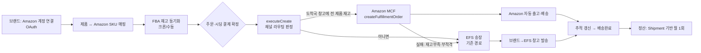
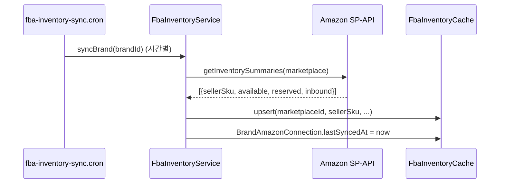
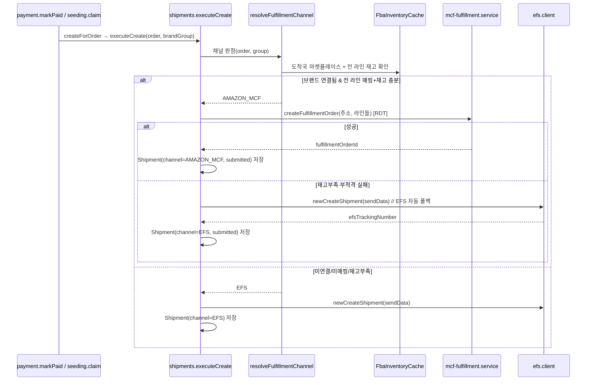
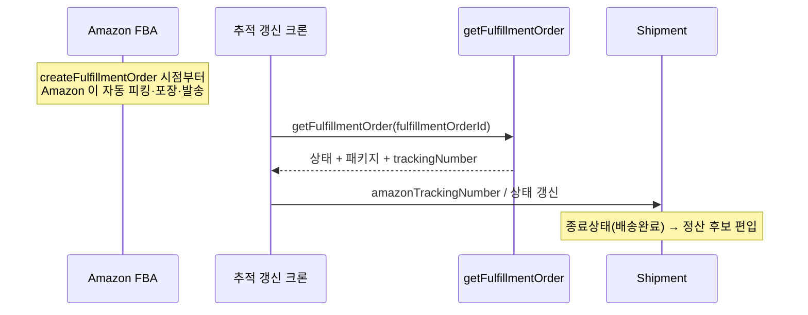

# ③ 전체 Amazon MCF 플로우

> 연결부터 정산까지 end-to-end. v1 결정(도메스틱 MCF · 브랜드 all-or-nothing · 시딩 지원 · 고객가 불변)
> 기준. 코드 참조는 `klow_server/` 기준.

## 0. 한눈에

## 1. 연결 (OAuth)

- 브랜드가 klow_brand `Amazon 창고` 페이지에서 리전(북미/유럽/극동) 마켓플레이스 `연결` →
  `GET /v1/brand/amazon/connect?region=..` → Amazon Seller Central consent → `callback` 에서
  authorization code → **refresh token** 교환 → `BrandAmazonConnection` 에 암호화 저장.
- 같은 리전의 다른 마켓플레이스는 재인증 없이 `바로 추가`(목업 로직과 동일).
- 토큰 만료(365일) → `status=reauth_required` → 카드에 `재연결 필요`.

## 2. 제품 ↔ SKU 매핑

- 브랜드가 KLOW 제품마다 그 마켓플레이스의 **Amazon 상품(sellerSku)** 을 연결 → `ProductAmazonListing`.
- 매핑 없는 제품은 항상 EFS. (목업의 `제품` 탭이 이 UI)

## 3. 재고 동기화 (기능 ①)

- 수동 동기화: `POST /v1/brand/amazon/sync` (브랜드 페이지 '지금 동기화').

## 4. 결제 → 발급 라우팅 (기능 ②) — 공통 chokepoint

**트리거는 이미 한 곳으로 수렴**: 일반주문·고객결제 시딩은 `payment.markPaid`(:442), 무료/브랜드결제
시딩은 `seeding.claim`(:440) → 둘 다 `shipments.createForOrder(orderId, null)` → 브랜드별 `executeCreate`.

**라우팅 규칙 (도메스틱 · 브랜드 all-or-nothing)**
1. 도착국(`order.countryCode`)에 대응하는 Amazon 마켓플레이스에 브랜드가 연결돼 있어야 함.
2. 그 브랜드의 **모든 라인**이 (productId 존재) + (해당 마켓플레이스 SKU 매핑 존재) + (재고 ≥ 수량) 을
   만족해야 Amazon. 하나라도 불만족 → 브랜드 전체 EFS.
3. `createFulfillmentOrder` 가 재고/적격 문제로 실패하면 **같은 발급 트랜잭션에서 EFS 로 폴백** — 주문은
   절대 멈추지 않는다.

## 5. 시딩 분기

- 시딩도 §4 와 동일 경로. 단, 시딩 라인이 **productId 를 실어야** SKU 매핑이 가능(seeding 서비스 수정).
- 시딩 라인에 productId 없음 → EFS. 있으면 도착국 재고에 따라 Amazon/EFS.

## 6. 자동 출고·추적 (기능 ③)

- KLOW 는 별도 발송 작업 없음 — `createFulfillmentOrder` 자체가 출고 지시.
- blank-box(무지 박스) 설정으로 Amazon 브랜딩 없이 배송.

## 7. 정산

- MCF `Shipment` 도 EFS 와 동일하게 `settlement.service` 후보에 편입(EFS `'33'` 게이트에 MCF 종료상태
  매핑 추가).
- 브랜드 정산액 = `Σ OrderItem.settlementPriceKrw × qty` (채널 무관).
- 출고 원가 라인: EFS=`efsChargeKrw`, MCF=`mcfFeeKrw`. **고객 결제가는 어느 채널이든 동일**(결제 시점
  `productLogisticsCostKrw` 기반으로 이미 확정).

## 8. 취소·환불 (후속)

- 발송 전 주문 취소/환불 → `cancelFulfillmentOrder` 연동(연동 시점은 열린 질문).

## 9. 채널 판정 요약표

| 조건 | 결과 |
|---|---|
| 브랜드가 도착국 마켓플레이스 미연결 | EFS |
| 브랜드 라인 중 SKU 미매핑 존재 | EFS (브랜드 전체) |
| 매핑됐지만 재고 < 수량인 라인 존재 | EFS (브랜드 전체) |
| 전 라인 매핑 + 재고 충분 | **Amazon MCF** |
| MCF 발급 호출 실패(재고/적격) | EFS 자동 폴백 |
| 시딩 라인 productId 없음 | EFS |
