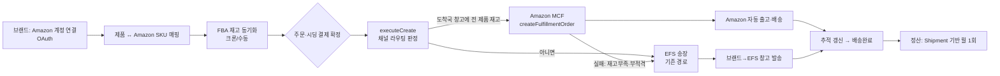
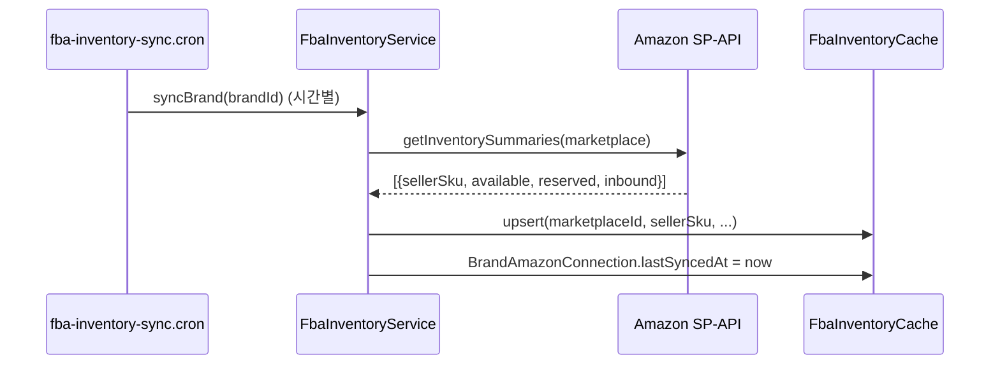
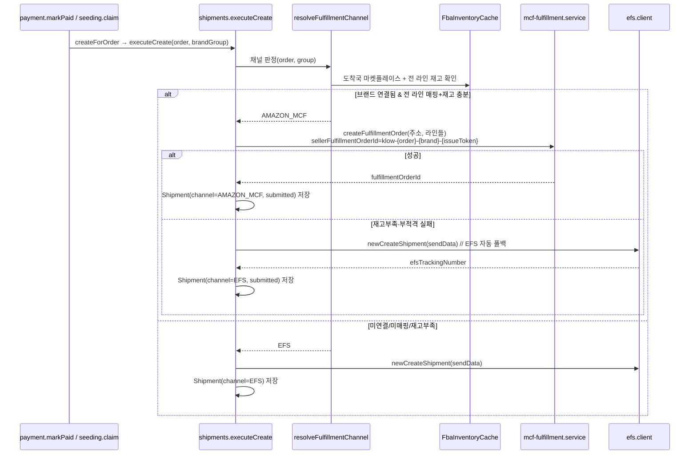
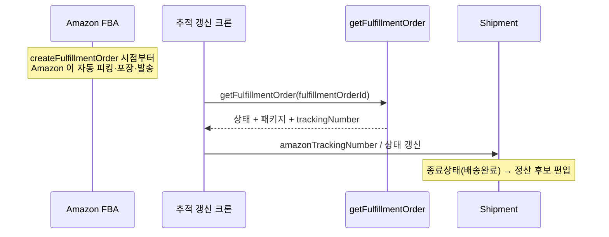

# ③ 전체 Amazon MCF 플로우

> 연결부터 정산까지 end-to-end. v1 결정(도메스틱 MCF · 브랜드 all-or-nothing · **시딩 v1 제외(항상 EFS)** · 고객가 불변)
> 기준. **정본은 `implementation-plan.md`** — 이 문서는 흐름 개요다. 코드 참조는 `klow_server/` 기준(라인번호는 2026-07-08 스냅샷).

## 0. 한눈에

## 1. 연결 (OAuth)

- 브랜드가 klow_brand `Amazon 창고` 페이지에서 리전(북미/유럽/극동) 마켓플레이스 `연결` →
  `GET /v1/brand/amazon/connect?region=..` → Amazon Seller Central consent → `callback` 에서
  authorization code → **refresh token** 교환 → `BrandAmazonConnection` 에 암호화 저장.
- 같은 리전의 다른 마켓플레이스는 재인증 없이 `바로 추가`(목업 로직과 동일).
- 토큰 만료(365일) → `status=reauth_required` → 카드에 `재연결 필요`.

## 2. 제품 ↔ SKU 매핑

- 브랜드가 KLOW 제품마다 그 마켓플레이스의 **Amazon 상품(sellerSku)** 을 연결 → `ProductAmazonListing`.
- 매핑 없는 제품은 항상 EFS. (목업의 `제품` 탭이 이 UI)

## 3. 재고 동기화 (기능 ①)

- 수동 동기화: `POST /v1/brand/amazon/sync` (브랜드 페이지 '지금 동기화').

## 4. 결제 → 발급 라우팅 (기능 ②) — 공통 chokepoint

**트리거는 이미 한 곳으로 수렴**: 일반주문·고객결제 시딩은 `payment.markPaid`(:442), 무료/브랜드결제
시딩은 `seeding.claim`(:440) → 둘 다 `shipments.createForOrder(orderId, null)` → 브랜드별 `executeCreate`.

**라우팅 규칙 (도메스틱 · 브랜드 all-or-nothing)**
0. `order.countryCode` 는 nullable(legacy 주문 null) — **null 이면 즉시 EFS**.
1. 도착국(`order.countryCode`)에 대응하는 Amazon 마켓플레이스에 브랜드가 연결돼 있어야 함.
2. 그 브랜드의 **모든 라인**이 (productId 존재) + (해당 마켓플레이스 SKU 매핑 존재) + (재고 ≥ 수량) 을
   만족해야 Amazon. 하나라도 불만족 → 브랜드 전체 EFS.
3. `createFulfillmentOrder` 가 재고/적격 문제로 **명확히 실패**하면 **같은 발급 트랜잭션에서 EFS 로 폴백** — 주문은
   절대 멈추지 않는다.
4. **응답 유실(네트워크 타임아웃 등 모호 실패)** 은 곧바로 EFS 폴백하면 Amazon+EFS 이중출고 위험(양 캐리어 교차).
   → `getFulfillmentOrder`/`listAllFulfillmentOrders` 로 **접수 여부를 먼저 확인**하고, 접수됐으면 MCF 로 확정,
   미접수면 EFS 폴백. (`sellerFulfillmentOrderId` 가 발급마다 유일하므로 확인 조회의 키로 쓸 수 있다.)

## 5. 시딩 분기 (v1: 항상 EFS)

- **v1 에서 시딩은 항상 EFS.** 시딩 `OrderItem.productId` 는 항상 null 이고, `SeedingLink.selectedSkus`/`selectionSkus`
  는 **제품 ID 가 아니라 자유텍스트 제품명 라벨**(`createLink` 는 trim/dedupe 만, `fetchProductCards` 는 `name` 으로
  Product 를 best-effort 조회)이라 productId → SKU 매핑 → FBA 재고 판정 경로를 탈 수 없다.
- 트리거는 §4 와 동일 chokepoint(`seeding.claim` → `createForOrder`)를 타지만, 라우팅 판정에서 `order.isSeeding === true`
  이면 곧바로 EFS(productId 해석 불가) — **추가 배선 불필요, 자연히 EFS**.
- **시딩 MCF 는 v2**: `SeedingLink` 선택 필드에 실제 productId 를 심는 스키마 변경 이후 재검토.

## 6. 자동 출고·추적 (기능 ③)

- KLOW 는 별도 발송 작업 없음 — `createFulfillmentOrder` 자체가 출고 지시.
- blank-box(무지 박스) 설정으로 Amazon 브랜딩 없이 배송.
- **⚠️ 한 MCF 주문이 여러 패키지로 분할될 수 있다**: 같은 브랜드 여러 라인을 한 `createFulfillmentOrder`(items N개)로 보내도,
  Amazon 이 창고 위치·크기·물류 판단으로 **여러 박스(package)로 쪼갤 수 있다** → **추적번호가 복수**. `getFulfillmentOrder` 응답의
  `fulfillmentShipments`/`packages` 로 확인한다. "한 주문 = 한 추적번호"로 가정하면 안 됨(→ 스키마·UI 는 복수 추적 대응).
  (서로 다른 브랜드는 계정 자체가 달라 애초에 합쳐지지 않음 — 브랜드별 개별 주문/배송, 기존 EFS "한 브랜드=한 송장"과 동일.)

## 7. 가격·정산 — MCF 마진 트랙 (판매가·정산가 2벌)

MCF 는 "보전(reimbursement)" 이 아니라 **채널별 가격 트랙**으로 처리한다. Amazon 은 EFS 국제 물류비가 안 드는 대신 **Amazon 이 브랜드 셀러 계정에서 자기 MCF 수수료를 뗀다** — 그래서 그 몫을 **MCF마진**에 미리 반영해 값을 잡는다. (핵심: KLOW 가 Amazon 수수료를 조회·보전하지 않는다.)

### 7-1. 판매가·정산가는 채널별 2벌
| | 판매가(고객) | 정산가(브랜드) |
|---|---|---|
| 일반(EFS) | 원가 + 마진 + 물류비/2 | 원가 + 마진 |
| MCF | 원가 + **MCF마진** | 원가 + **MCF마진** |

- **MCF마진 기본값 = 마진 + 물류비/2** → MCF 판매가·정산가가 일반과 같은 값으로 시작. 브랜드/어드민이 **MCF마진만 조절**해 MCF 트랙을 독립적으로 움직인다.
- Amazon 은 EFS 물류비가 안 드니 그 몫(물류비/2)이 MCF마진으로 흡수되고, 브랜드는 그 안에서 자기 Amazon 수수료를 감안해 값을 정한다.
- 정확한 식은 기존 `product-selects.ts priceLine()`·÷0.95 PG·배송비 라인과 대조해 확정한다 — **특히 MCF 주문에서 별도 배송비 라인을 0 으로 둘지**.

### 7-2. Amazon 수수료는 브랜드가 부담 (KLOW 보전·조회 없음)
- Amazon MCF 이행 수수료는 **재고 소유자=브랜드의 셀러 계정에서 자동 차감**된다. **KLOW 엔 청구 안 됨**(KLOW 는 SP-API 사용료만 별도).
- 브랜드가 이 수수료를 **MCF마진에 미리 반영**해 값을 책정하므로, KLOW 가 실제 수수료를 **조회하거나 보전할 필요가 없다**
  → `getFulfillmentPreview`/Finances API·Finance Role **불필요**. (`mcfChargeKrw` 는 남겨도 "이 브랜드 MCF 남는 장사냐" 분석용일 뿐 money flow 와 무관.)

### 7-3. 정산 — 실제 나간 채널의 정산가 사용
- 브랜드 정산액 = `Σ (그 라인이 실제 나간 채널의 정산가) × qty`. MCF 로 나갔으면 MCF 정산가, EFS(폴백 포함)면 일반 정산가.
- settleable 후보 게이트가 EFS 종료상태 `latestStatusCode='33'`(=delivered)를 **Prisma `where` 안에 하드코딩**한다
  (`settlement.service.ts` 4곳: 요약 :100·후보목록 :193·브랜드후보 :298·settle :328). **MCF 종료상태도 delivered 로 인식**하도록
  `settleableDeliveredWhere(): Prisma.ShipmentWhereInput`(EFS `'33'` / MCF `mcfStatus in MCF_TERMINAL`) where-빌더를 신설해 4곳 치환.
  (JS 불리언이 아니라 where-프래그먼트 — 게이트가 쿼리 조건이라. 상세 implementation-plan F5.)
  - 주의: 이 "정산용 delivered('33')" 는 폴링 중단용 `TERMINAL_TRACKING_CODES=['33','47','74','42']` 와 **다른 집합**이다.

### 7-4. 표시가격·폴백
- 고객에게는 그 제품이 도착국 Amazon 적격(연결+매핑+재고)이면 **MCF 판매가**, 아니면 **일반 판매가**를 표시한다.
- 라우팅은 결제 시 확정되고 재고부족이면 EFS 폴백 → **MCF 가격으로 결제됐는데 EFS 로 나갈 수 있다**. 기본값(두 가격 동일)이면 무영향,
  브랜드가 MCF 가격을 낮춰둔 경우의 차액은 **KLOW 가 흡수**(재고 캐시가 어긋난 드문 케이스).
- (기본값에선 MCF·일반 판매가가 같아 고객가 체감은 동일. MCF마진을 조절하면 MCF 판매가만 독립적으로 달라진다.)

## 8. 취소·환불 (후속)

- 발송 전 주문 취소/환불 → `cancelFulfillmentOrder` 연동(연동 시점은 열린 질문).

## 9. 채널 판정 요약표

| 조건 | 결과 |
|---|---|
| `order.countryCode` 가 null(legacy) | EFS |
| 브랜드가 도착국 마켓플레이스 미연결 | EFS |
| 브랜드 라인 중 SKU 미매핑 존재 | EFS (브랜드 전체) |
| 매핑됐지만 재고 < 수량인 라인 존재 | EFS (브랜드 전체) |
| 전 라인 매핑 + 재고 충분 | **Amazon MCF** |
| MCF 발급 호출 실패(재고/적격) | EFS 자동 폴백 |
| MCF 호출 응답 유실(타임아웃 등) | 접수여부 확인 후 폴백 (§4·이중출고 방지) |
| 시딩 주문(v1) | EFS (제품 ID 해석 불가) |
