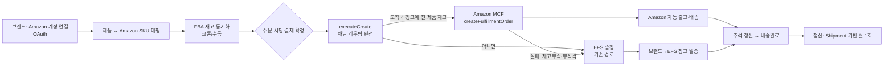
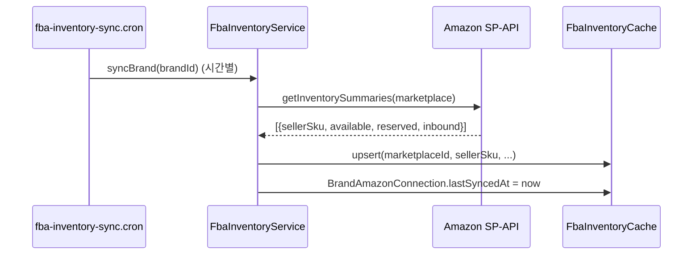
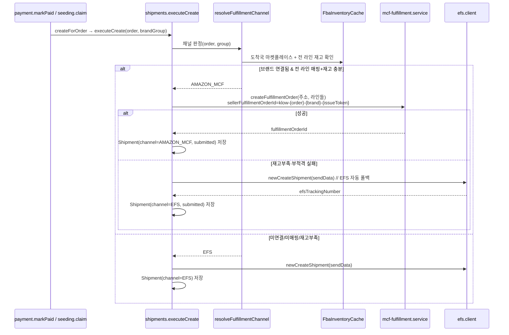
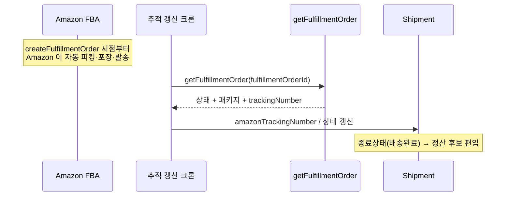

# ③ 전체 Amazon MCF 플로우

> 연결부터 정산까지 end-to-end. v1 결정(도메스틱 MCF · 브랜드 all-or-nothing · **시딩 v1 제외(항상 EFS)** · 고객가 불변)
> 기준. **정본은 `implementation-plan.md`** — 이 문서는 흐름 개요다. 코드 참조는 `klow_server/` 기준(라인번호는 2026-08-01 스냅샷).
>
> **🔄 2026-08-01 가격 최신화**: §7 이 통째로 바뀌었다 — 판매가·정산가에서 물류비가 빠진 뒤(2026-07-28/30 전환)
> **채널별 가격 2벌·`mcfMarginKrw`·MCF 표시가·폴백 가격차 흡수는 전부 폐기**됐고, MCF 는 가격 경로를 건드리지 않는다.

## 0. 한눈에

```mermaid
flowchart LR
  A[브랜드: Amazon 계정 연결<br/>OAuth] --> B[제품 ↔ Amazon SKU 매핑]
  B --> C[FBA 재고 동기화<br/>크론/수동]
  C --> D{주문·시딩 결제 확정}
  D --> E[executeCreate<br/>채널 라우팅 판정]
  E -->|도착국 창고에 전 제품 재고| F[Amazon MCF<br/>createFulfillmentOrder]
  E -->|아니면| G[EFS 송장<br/>기존 경로]
  F -->|실패: 재고부족·부적격| G
  F --> H[Amazon 자동 출고·배송]
  G --> I[브랜드→EFS 창고 발송]
  H --> J[추적 갱신 → 배송완료]
  I --> J
  J --> K[정산: Shipment 기반 월 1회]
```

## 1. 연결 (OAuth)

- 브랜드가 klow_brand `Amazon 창고` 페이지에서 리전(북미/유럽/극동) 마켓플레이스 `연결` →
  `GET /v1/brand/amazon/connect?region=..` → Amazon Seller Central consent → `callback` 에서
  authorization code → **refresh token** 교환 → `BrandAmazonConnection` 에 암호화 저장.
- 같은 리전의 다른 마켓플레이스는 재인증 없이 `바로 추가`(목업 로직과 동일).
- 토큰 만료(365일) → `status=reauth_required` → 카드에 `재연결 필요`.

## 2. 제품 ↔ SKU 매핑

- 브랜드가 KLOW 제품마다 그 마켓플레이스의 **Amazon 상품(sellerSku)** 을 연결 → `ProductAmazonListing`.
- 매핑 없는 제품은 항상 EFS. (목업의 `제품` 탭이 이 UI)

## 3. 재고 동기화 (기능 ①)

```mermaid
sequenceDiagram
  participant Cron as fba-inventory-sync.cron
  participant Svc as FbaInventoryService
  participant SP as Amazon SP-API
  participant DB as FbaInventoryCache
  Cron->>Svc: syncBrand(brandId) (시간별)
  Svc->>SP: getInventorySummaries(marketplace)
  SP-->>Svc: [{sellerSku, available, reserved, inbound}]
  Svc->>DB: upsert(marketplaceId, sellerSku, ...)
  Svc->>DB: BrandAmazonConnection.lastSyncedAt = now
```
- 수동 동기화: `POST /v1/brand/amazon/sync` (브랜드 페이지 '지금 동기화').

## 4. 결제 → 발급 라우팅 (기능 ②) — 공통 chokepoint

**트리거는 이미 한 곳으로 수렴**: 일반주문·고객결제 시딩은 `payment.markPaid`, 무료/브랜드결제
시딩은 `seeding.claim` → 둘 다 `shipments.createForOrder(orderId, null)`(:571 / :653) → 브랜드별 `executeCreate`(:644).
**결제 후에 라우팅이 일어난다** — 가격·배송비는 이미 확정·스냅샷된 뒤다(§7-2).

```mermaid
sequenceDiagram
  participant Pay as payment.markPaid / seeding.claim
  participant Ship as shipments.executeCreate
  participant Route as resolveFulfillmentChannel
  participant Inv as FbaInventoryCache
  participant MCF as mcf-fulfillment.service
  participant EFS as efs.client

  Pay->>Ship: createForOrder → executeCreate(order, brandGroup)
  Ship->>Route: 채널 판정(order, group)
  Route->>Inv: 도착국 마켓플레이스 + 전 라인 재고 확인
  alt 브랜드 연결됨 & 전 라인 매핑+재고 충분
    Route-->>Ship: AMAZON_MCF
    Ship->>MCF: createFulfillmentOrder(주소, 라인들)<br/>sellerFulfillmentOrderId=klow-{order}-{brand}-{issueToken}
    alt 성공
      MCF-->>Ship: fulfillmentOrderId
      Ship->>Ship: Shipment(channel=AMAZON_MCF, submitted) 저장
    else 재고부족·부적격 실패
      Ship->>EFS: newCreateShipment(sendData)  // EFS 자동 폴백
      EFS-->>Ship: efsTrackingNumber
      Ship->>Ship: Shipment(channel=EFS, submitted) 저장
    end
  else 미연결/미매핑/재고부족
    Route-->>Ship: EFS
    Ship->>EFS: newCreateShipment(sendData)
    Ship->>Ship: Shipment(channel=EFS) 저장
  end
```

**라우팅 규칙 (도메스틱 · 브랜드 all-or-nothing)**
0. `order.countryCode` 는 nullable(legacy 주문 null) — **null 이면 즉시 EFS**.
1. 도착국(`order.countryCode`)에 대응하는 Amazon 마켓플레이스에 브랜드가 연결돼 있어야 함.
2. 그 브랜드의 **모든 라인**이 (productId 존재) + (해당 마켓플레이스 SKU 매핑 존재) + (재고 ≥ 수량) 을
   만족해야 Amazon. 하나라도 불만족 → 브랜드 전체 EFS.
3. `createFulfillmentOrder` 가 재고/적격 문제로 **명확히 실패**하면 **같은 발급 트랜잭션에서 EFS 로 폴백** — 주문은
   절대 멈추지 않는다.
4. **응답 유실(네트워크 타임아웃 등 모호 실패)** 은 곧바로 EFS 폴백하면 Amazon+EFS 이중출고 위험(양 캐리어 교차).
   → `getFulfillmentOrder`/`listAllFulfillmentOrders` 로 **접수 여부를 먼저 확인**하고, 접수됐으면 MCF 로 확정,
   미접수면 EFS 폴백. (`sellerFulfillmentOrderId` 가 발급마다 유일하므로 확인 조회의 키로 쓸 수 있다.)
5. **가격·배송비 관련 값은 판정에 안 들어간다** — 무료배송(`ProductCountryPrice.freeShipping`)·박스 무게·브랜드별
   캐리어(`shippingCarrierByBrand`)는 이미 주문 시점에 정해진 EFS 쪽 값이라 라우팅과 무관하다. MCF 행에도 그 캐리어
   스냅샷을 그대로 저장한다(사용되지 않는 값 — F1).

## 5. 시딩 분기 (v1: 항상 EFS)

- **v1 에서 시딩은 항상 EFS.** 시딩 `OrderItem.productId` 는 항상 null 이고, `SeedingLink.selectedSkus`/`selectionSkus`
  는 **제품 ID 가 아니라 자유텍스트 제품명 라벨**(`createLink` 는 trim/dedupe 만, `fetchProductCards` 는 `name` 으로
  Product 를 best-effort 조회)이라 productId → SKU 매핑 → FBA 재고 판정 경로를 탈 수 없다.
- 트리거는 §4 와 동일 chokepoint(`seeding.claim` → `createForOrder`)를 타지만, 라우팅 판정에서 `order.isSeeding === true`
  이면 곧바로 EFS(productId 해석 불가) — **추가 배선 불필요, 자연히 EFS**.
- **시딩 MCF 는 v2**: `SeedingLink` 선택 필드에 실제 productId 를 심는 스키마 변경 이후 재검토.

## 6. 자동 출고·추적 (기능 ③)

```mermaid
sequenceDiagram
  participant AZ as Amazon FBA
  participant Poll as 추적 갱신 크론
  participant SP as getFulfillmentOrder
  participant DB as Shipment
  Note over AZ: createFulfillmentOrder 시점부터<br/>Amazon 이 자동 피킹·포장·발송
  Poll->>SP: getFulfillmentOrder(fulfillmentOrderId)
  SP-->>Poll: 상태 + 패키지 + trackingNumber
  Poll->>DB: amazonTrackingNumber / 상태 갱신
  Note over DB: 종료상태(배송완료) → 정산 후보 편입
```
- KLOW 는 별도 발송 작업 없음 — `createFulfillmentOrder` 자체가 출고 지시.
- blank-box(무지 박스) 설정으로 Amazon 브랜딩 없이 배송.
- **⚠️ 한 MCF 주문이 여러 패키지로 분할될 수 있다**: 같은 브랜드 여러 라인을 한 `createFulfillmentOrder`(items N개)로 보내도,
  Amazon 이 창고 위치·크기·물류 판단으로 **여러 박스(package)로 쪼갤 수 있다** → **추적번호가 복수**. `getFulfillmentOrder` 응답의
  `fulfillmentShipments`/`packages` 로 확인한다. "한 주문 = 한 추적번호"로 가정하면 안 됨(→ 스키마·UI 는 복수 추적 대응).
  (서로 다른 브랜드는 계정 자체가 달라 애초에 합쳐지지 않음 — 브랜드별 개별 주문/배송, 기존 EFS "한 브랜드=한 송장"과 동일.)

## 7. 가격·정산 — 채널 무관 1벌 (2026-08-01 최신화)

**한 줄: MCF 는 가격 경로를 전혀 건드리지 않는다.** 2026-07-28 전환에서 판매가·정산가에서 **물류비가 완전히 빠졌고**
(`판매가 = 정산가/0.95/fx`, `정산가 = floor(청구USD × fx × 0.95)` — PG 5% 만 차감), 고객 배송비는 **판매가 바깥의
별도 라인**이 됐다(→ [`../pricing-model.md`](../pricing-model.md)). 물류비가 애초에 가격에 안 들어가니 **"Amazon 은 EFS 물류비가
안 드니 그만큼 빼자"는 옛 2벌 설계는 뺄 것이 없어져 폐기**됐다. MCF 로 갈리는 건 **배송비 선결제분의 귀속**(§7-3) 하나뿐이다.

> **폐기된 옛 설계(2026-07-08)**: MCF 판매가/정산가 2벌 · `ProductAmazonListing.mcfMarginKrw` · MCF 표시가 분기 ·
> "MCF 가로 결제 후 EFS 폴백 시 차액 KLOW 흡수". 물류비/2 마크업이 사라지면서 전부 근거를 잃었다.

### 7-1. 판매가·정산가 — 채널 구분 없음
| | 판매가(고객, 고정) | 정산가(브랜드, 역산) |
|---|---|---|
| 일반(EFS) | 고정 판매가 | `floor(청구USD × fx × 0.95)` |
| MCF | **동일** | **동일** |

- 정산가는 **주문 시점**에 `priceLine()` 이 역산해 `OrderItem.settlementPriceKrw` 로 박힌다 — 발급(라우팅)보다 **먼저** 확정되고,
  채널이 뭐든 그 값이 정산에 그대로 쓰인다. **MCF 분기가 이 값을 재계산·덮어쓰면 안 된다**(F8).
- 제품 단위에 MCF 전용 가격/마진 필드는 **두지 않는다**. (채널별 차등이 훗날 정말 필요하면 v2 — 지금은 표시·주문·정산 전 경로가
  단일 값을 공유하는 게 불변식이다.)

### 7-2. 고객 결제 배송비 — 채널과 무관, 주문 시점 확정
- 고객 배송비 = **`SeedingRate` 500g 티어 / fx × 청구 대상 브랜드수**(한 브랜드 = 한 송장). 무료배송은 **국가별**
  (`ProductCountryPrice.freeShipping`)이고 **그 브랜드 라인이 전부 무료일 때만** 면제 — `orders/chargeable-brands.ts`
  `chargeableBrandIds`/`shippingFeeByBrand` 가 단일 출처.
- **순서가 핵심**: 배송비는 `POST /v1/orders`(결제 전)에서 확정·스냅샷(`Order.shippingFeeUsd` + `shippingFeeByBrand`)되고,
  채널 라우팅은 **결제 확정 후** `executeCreate` 에서 일어난다. → **MCF 로 나가도 고객이 낸 배송비는 EFS 요율 그대로**이고,
  견적(`/v1/orders/quote`)·카트·체크아웃은 MCF 를 **몰라도 된다**(수정 대상 아님).
- **R8 (구매 가능 국가는 안 넓어진다)**: 배송지원(`enabled`) 제외국·500g 요율/캐리어 미설정국·EFS 제외구역은 주문 생성에서
  차단된다. 라우팅이 그 뒤라 **Amazon 창고가 커버하는 나라여도 EFS 게이트를 못 열면 애초에 결제가 안 된다.** MCF 로 새 나라를
  열려면 그 나라의 요율표·캐리어·`enabled` 를 별도로 채워야 한다.

### 7-3. ⚠️ 배송비 선결제분의 귀속 — v1 유일한 미확정 정책
현 모델에서 고객이 낸 배송비는 **브랜드 실측 물류비의 선납금**이다. EFS 면 `efs-billing` 이 일반주문을
`max(0, EFS실비 + 수수료 − 선결제)` 로 청구해 선결제분이 브랜드에게 되돌아간다. **MCF 는 EFS 청구서 자체가 없다** —
브랜드 이행 비용은 Amazon 이 셀러 계정에서 떼는 MCF 수수료이고, 고객 선결제분은 KLOW 에 남는다.

| 안 | 내용 | 장단 |
|---|---|---|
| **(A)** KLOW 보유 | 아무것도 안 한다 | 코드 변경 0. 브랜드는 EFS 후청구가 없어지는 대신 Amazon 수수료를 전액 부담 — 유불리는 `Amazon 수수료 ⋛ 실측−선결제` 에 달림 |
| **(B)** 브랜드 크레딧 *(권고)* | 정산 시 `perBrandShareUsd(order, brandId, n) × Order.fxRateSnapshot` 를 가산 | "선결제 = 그 브랜드 배송의 선납금" 정의를 채널 무관하게 유지. 무료배송 국가는 선결제 0 → 자동으로 크레딧 0. 정산 합산식에 배송비 항이 하나 생김(현재는 `Σ settlementPriceKrw × qty` 뿐) |

- 어느 쪽이든 **금액 출처는 `Order.shippingFeeByBrand` 스냅샷 하나**(legacy 주문은 균등분배 폴백) — 송장 EFS 27번·EFS 청구서와
  같은 함수(`perBrandShareUsd`)를 써야 값이 갈리지 않는다.
- **파일럿은 (A) 로 시작해도 된다** — (B) 는 정산 UI/집계까지 손대므로, 실출고 검증 뒤 별도 릴리스로 붙이는 편이 안전하다.

### 7-4. Amazon 수수료는 브랜드가 부담 (KLOW 보전·조회 없음)
- MCF 이행 수수료는 **재고 소유자=브랜드의 셀러 계정에서 자동 차감**된다. **KLOW 엔 청구 안 됨**(KLOW 는 SP-API 사용료만 별도).
- 가격이 채널 무관 1벌이므로 브랜드는 이 수수료를 **가격에 반영하는 게 아니라 "이 제품을 MCF 로 보낼지" 판단에 쓴다**
  (마진은 채널과 무관하게 같고, 이행 비용만 EFS 후청구 ↔ Amazon 수수료로 갈린다).
- KLOW 가 실제 수수료를 **조회·보전하지 않으므로** `getFulfillmentPreview`/Finances API·Finance Role **불필요**.
  (`mcfChargeKrw` 는 "이 브랜드 MCF 남는 장사냐" 분석용 옵션일 뿐 money flow 와 무관.)

### 7-5. 정산 — 스냅샷 합산 그대로 + delivered 게이트만 확장
- 브랜드 정산액 = `Σ OrderItem.settlementPriceKrw × qty` — **채널 판별이 필요 없다**(값이 같으므로). MCF 발급 코드는 정산가를
  읽지도 쓰지도 않는다.
- 남는 작업은 **후보 게이트 하나**: settleable 게이트가 EFS 종료상태 `latestStatusCode='33'`(=delivered)를 **Prisma `where` 안에
  하드코딩**한다 (`settlement.service.ts` 4곳: `listAdminCandidates` :216 · `listAdminBrandCandidates` :390 · `settle()` :470 ·
  `listAdminMonthly` :527). **MCF 종료상태도 delivered 로 인식**하도록 `settleableDeliveredWhere(): Prisma.ShipmentWhereInput`
  (EFS `'33'` / MCF `mcfStatus in MCF_TERMINAL`) where-빌더를 신설해 4곳 치환.
  (JS 불리언이 아니라 where-프래그먼트 — 게이트가 쿼리 조건이라. 상세 implementation-plan F5.)
  - 주의: 이 "정산용 delivered('33')" 는 폴링 중단용 `TERMINAL_TRACKING_CODES=['33','47','74','42']` 와 **다른 집합**이다.
  - `listDeliveredForBrand`(브랜드 정산 탭 목록)는 delivered 게이트 없이 `brandConfirmedShippedAt` 기준이라 별도 검토 —
    MCF 는 브랜드가 박스를 인계하지 않으므로 이 값이 영영 null 이다(→ MCF 행은 브랜드 정산 탭에 안 뜬다. 발급 시 채우거나
    조건을 채널별로 분기해야 한다).
- **F10 (EFS 청구서는 MCF 를 자연 제외 — 좋은 성질)**: `efs-billing` 은 2026-07-29 부터 시딩 전용이 아니라 **일반주문도 청구**하지만,
  후보 쿼리가 `efsTrackingNumber: { not: null }` 로 거른다. MCF 행은 그 값이 null 이라 **자동 제외** → EFS 실비 없는 행에
  청구서가 만들어질 위험이 없다. (§7-3 (B) 를 택하면 크레딧은 **정산** 쪽에 붙이고 청구서는 그대로 둔다.)

## 8. 취소·환불 (후속)

- 발송 전 주문 취소/환불 → `cancelFulfillmentOrder` 연동(연동 시점은 열린 질문).

## 9. 채널 판정 요약표

| 조건 | 결과 |
|---|---|
| `order.countryCode` 가 null(legacy) | EFS |
| 브랜드가 도착국 마켓플레이스 미연결 | EFS |
| 브랜드 라인 중 SKU 미매핑 존재 | EFS (브랜드 전체) |
| 매핑됐지만 재고 < 수량인 라인 존재 | EFS (브랜드 전체) |
| 전 라인 매핑 + 재고 충분 | **Amazon MCF** |
| MCF 발급 호출 실패(재고/적격) | EFS 자동 폴백 |
| MCF 호출 응답 유실(타임아웃 등) | 접수여부 확인 후 폴백 (§4·이중출고 방지) |
| 시딩 주문(v1) | EFS (제품 ID 해석 불가) |
| 무료배송 국가 / 박스 무게 / 캐리어 | **판정에 영향 없음** (주문 시점 EFS 배송비 값 — §7-2) |

**어느 채널로 가든 같은 것**: 고객 결제가 · 고객 결제 배송비 · `OrderItem.settlementPriceKrw`(브랜드 정산 단가).
**갈리는 것**: 실제 출고 주체(브랜드→EFS 창고 vs Amazon 창고) · 브랜드의 이행 비용(EFS 실측 후청구 vs Amazon MCF 수수료) ·
고객 배송비 선결제분의 귀속(§7-3, 미확정).
