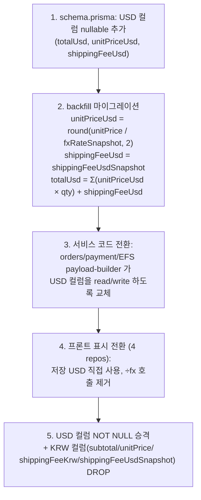

# Pricing — 고객측 가격 USD 정본화 (풀 전환)

본 문서는 KLOW 주문/결제 장부의 **고객측 금액을 USD 정본(canonical)으로 전환**하는 설계와
마이그레이션 절차를 정의한다. 브랜드 정산측은 KRW를 유지한다. 실제 스키마·코드 적용은 각
subproject repo(`klow_server` 등)에서 별도 작업으로 수행하며, 본 문서는 그 단일 기준이다.

> 결제 흐름 자체는 [`payment-integration.md`](./payment-integration.md), 전체 모델은
> [`architecture.md`](./architecture.md) Order/Payment 섹션 참고.

---

## 1. 배경 — 왜 전환하는가

지금 주문/결제 장부는 **모든 금액을 KRW로 저장**하고, 읽는 쪽(PG·EFS 송장·화면)에서 매번
`÷ fxRateSnapshot` 로 USD를 재계산한다. 그런데 고객이 **실제로 낸 돈은 USD**다. 이 어긋남에서
세 가지 비용이 나온다.

1. **Round-trip 양자화 오차** — 소비자가를 USD에서 시작해 `× fx` 로 KRW로 박았다가, 결제 때 다시
   `÷ fx → .toFixed(2)` 로 USD로 되돌린다. USD에서 출발해 KRW를 거쳐 USD로 돌아오므로 센트 단위
   오차가 누적된다.

   ```ts
   // payment.service.ts (현행)
   const amountUsd = (order.subtotal / fxRate).toFixed(2);   // KRW → USD 재환산
   ```

2. **실거래 금액 기록 없음** — PG(Eximbay)가 승인한 실제 USD는 `verify` 단계에서 검증에만 쓰고
   버려진다. 장부에는 KRW(`subtotal`)만 남아, 고객이 실제 결제한 금액이 원장에 보존되지 않는다.

3. **중복 컬럼** — `Order.shippingFeeKrw` 와 `Order.shippingFeeUsdSnapshot` 가 같은 배송비를 두
   통화로 중복 보관한다.

**핵심 원칙**: 통화를 개념별로 고정한다. **고객에게 받는 돈은 USD, 브랜드에 주는 돈은 KRW.**
이렇게 하면 가장자리(화면·PG·송장)의 환산이 사라지고, "고객 원장(USD) / 브랜드 원장(KRW)"이
깔끔히 분리된다. 마진은 두 원장의 차이이며, 환위험은 `fxRateSnapshot` 으로 계속 추적 가능하다.

---

## 2. 목표 스키마

| 개념 | 컬럼 | 통화 | 변경 |
|------|------|------|------|
| 브랜드 정산가(입력) | `Product.salePrice` | KRW | 유지 |
| 브랜드 정산 스냅샷 | `OrderItem.settlementPriceKrw` | KRW | 유지 |
| 고객 결제 단가 | `OrderItem.unitPriceUsd` | USD 센트(`Int`) | **신규** (← `unitPrice` KRW 대체) |
| 고객 결제 총액(= PG 청구액) | `Order.totalUsd` | USD 센트(`Int`) | **신규** (← `subtotal` KRW 대체) |
| 배송비 | `Order.shippingFeeUsd` | USD 센트(`Int`) | **신규** (← `shippingFeeUsdSnapshot` Float 대체) |
| 환율 스냅샷 | `Order.fxRateSnapshot` | Float | 유지 (감사·복원·정산 환산 기준) |
| ~~`Order.subtotal`~~ | — | KRW | **제거** |
| ~~`Order.shippingFeeKrw`~~ | — | KRW | **제거** (USD와 중복) |
| ~~`OrderItem.unitPrice`~~ | — | KRW | **제거** |

> **통화 타입 결정**: USD 금액은 **정수 센트(`Int`)** 로 저장한다 (`2630` = `$26.30`). 기존 KRW
> `Int` 컨벤션과 일치하고 `Prisma.Decimal` 도입 없이 합산이 정확·단순하다. KRW→USD 환산만 센트로
> 반올림하면 되고(`round(krw / fx × 100)`), 표시·PG 경계에서만 `(cents/100).toFixed(2)` → `"26.30"`
> 로 변환해 PG 에코와 정확히 일치시킨다. (`Float` 누적 오차 회피.)

효과: `Order.totalUsd` 가 PG에 **그대로** 넘어가 `÷fx` round-trip 이 사라진다. 마진은
`totalUsd − (Σ settlementPriceKrw ÷ fxRateSnapshot)` 로 여전히 계산 가능하다.

---

## 3. 통화 흐름 — Before / After

```
BEFORE (KRW 정본 — 모두가 ÷fx)
  Product.salePrice(KRW) ─×fx→ unitPrice(KRW) ─Σ→ subtotal(KRW)
                                                     │
                          PG청구:  subtotal ÷fx → "26.30" USD   ← round-trip 오차
                          EFS송장: unitPrice ÷fx → USD
                          화면:    subtotal ÷fx → USD

AFTER (USD 정본 — 가장자리 환산 없음)
  Product.salePrice(KRW) ──┬─×fx→ unitPriceUsd(USD) ─Σ→ totalUsd(USD) ──→ PG청구(그대로)
                           │                                          ├─→ EFS송장(그대로)
                           │                                          └─→ 화면(그대로)
                           └─→ settlementPriceKrw(KRW)  ── 브랜드 정산(원화, ÷fx 불필요)
  fxRateSnapshot(Float) ── 감사/마진/정산 환산 기준으로만 보존
```

> **범위 경계 (중요)**: 위 "÷fx 제거"는 **주문이 생성된 뒤(order ledger)** 에만 적용된다. 아직
> 주문되지 않은 **상품 카드·목록·상세의 노출 가격**은 스냅샷이 없으므로 여전히
> `salePrice(KRW) × 실시간 fxRate` 로 **표시 시점에 USD를 계산**한다(스냅샷 불가). 즉 본 전환은
> "주문·결제 장부의 통화 정본"을 USD로 옮기는 것이고, **상품 노출 단계의 KRW→USD 환산은 그대로
> 남는다.** 이 노출 단계 환산 공식이 4개 repo에 복제돼 있는 문제(#4)는 별개 작업이다(§8 참고).



단계 1–4 동안 KRW 컬럼이 그대로 남아 있어 **언제든 코드만 되돌리면 무손실 복구**가 가능하다.
파괴적 단계(5)는 단계 3–4 가 운영에서 안정화된 뒤 분리된 PR로 진행한다.

---

## 5. 단계별 상세

### 단계 1–2 — 스키마 + backfill (`klow_server`)

- **반드시 `npx prisma migrate dev --name <이름>` 만 사용한다.** `db push`·수동 SQL 파일·`migrate
  deploy` 금지 (workspace 규칙). non-interactive 환경에서 실패하면 사용자에게 직접 실행을 요청한다.
- USD 3컬럼을 **nullable 로 먼저 추가**한 뒤, 같은 마이그레이션의 SQL `UPDATE` 로 backfill 한다.
- 라운딩은 PG에 보내던 기존 `.toFixed(2)` 와 **동일하게** 맞춘다 — backfill 값과 신규 계산 값이
  어긋나면 검증(§6-1)이 깨진다.
- **라인 합 = 총액 invariant (중요)**: 신규 주문(§5 단계 3)은 `totalUsd = Σ(unitPriceUsd × qty) +
  shippingFeeUsd` 로 정의된다. backfill 도 **반드시 같은 방식** — `totalUsd` 를 `subtotal/fx` 로 따로
  반올림하지 말고, **먼저 채운 `unitPriceUsd` 라인들을 합산**해 맞춘다. 그렇지 않으면 라인별 반올림
  잔차 때문에 `Σ 라인 + 배송비 ≠ totalUsd` 인 과거 주문이 생겨 EFS 송장 라인 합이 PG 청구 총액과
  어긋난다(신규/기존 주문이 다른 invariant를 갖게 됨). 아래 SQL은 이 순서(라인 → 총액)를 강제한다.

  ```sql
  -- backfill 예시 (마이그레이션 SQL 내) — USD 센트(정수). 순서 중요: 라인 먼저, 총액은 라인 합산으로
  -- 1) 라인 단가 (USD 센트) + 배송비 (Float USD → 센트 반올림)
  UPDATE "OrderItem" oi SET
    "unitPriceUsd" = ROUND(oi."unitPrice"::numeric / o."fxRateSnapshot" * 100)::int
  FROM "Order" o
  WHERE oi."orderId" = o."id";

  UPDATE "Order" SET "shippingFeeUsd" = ROUND("shippingFeeUsdSnapshot"::numeric * 100)::int;

  -- 2) 총액(센트) = Σ(라인 센트 × 수량) + 배송비 센트  ← subtotal/fx 로 따로 반올림하지 않는다
  UPDATE "Order" o SET
    "totalUsd" = COALESCE((
      SELECT SUM(oi."unitPriceUsd" * oi."quantity")
      FROM "OrderItem" oi WHERE oi."orderId" = o."id"
    ), 0) + COALESCE(o."shippingFeeUsd", 0);
  ```

- **`fxRateSnapshot` 이 null 인 과거 row**: 당시 환율을 알 수 없으므로 위 라인 단가 backfill의
  `o."fxRateSnapshot"` 을 `COALESCE("fxRateSnapshot", (SELECT "usdKrwRate" FROM "ShopSettings"
  WHERE id='default'), 1380)` 로 fallback 한다. 이런 row는 근사값임을 audit 로그/주석에 남긴다
  (snapshot 있는 row는 기존 `.toFixed(2)` 청구액의 정확 재현이지만, null row는 진짜 근사다).

### 단계 3 — 서버 서비스 전환 (`klow_server`)

| 파일 | 변경점 |
|------|--------|
| `src/modules/orders/` (orders.service) | 주문 생성 시 `unitPriceUsd`/`totalUsd`/`shippingFeeUsd` 를 **직접 계산해 저장**. `Σ unitPriceUsd × qty + shippingFeeUsd = totalUsd`. KRW 합산 경로 제거. |
| `src/common/pricing.ts` | `GLOBAL_SALE_MARKUP_USD`($15 마크업)/`PAYMENT_FEE_RATE`(5%) 기반 소비자가 산출을 **USD로 일원화**. 이미 `(settlementUSD + $15) / (1 − 0.05)` 로 USD에서 출발하므로 결과를 `×fx → KRW 저장` 하던 마지막 단계만 삭제(USD 그대로 반환). 배송비는 단가 공식과 무관(`ShippingCarrierConfig.feeUsd` 별도). |
| `src/modules/payment/payment.service.ts` | `prepare`·`verify`·`refundOrder` 의 `subtotal / fxRate` 계산을 **`order.totalUsd` 직접 사용**으로 교체. 금액 검증은 `|paidUsd − totalUsd| ≤ 0.01`. |
| EFS payload-builder (Shipment 모듈) | 24번 itemCapsule 단가 = `unitPriceUsd` 직접, 27번 배송비 안분 = `shippingFeeUsd / brandCount` (÷fx 제거). |
| settlement.service | `settlementPriceKrw` 합산이라 **로직 불변**. 단 `unitPrice`(KRW)를 참조하는 곳이 없는지 확인하고, 있으면 `settlementPriceKrw` 로 교정. |
| `product-selects.ts` / products 모듈 | 카트 라인(`CartLine`)·가격 노출 필드 점검 (표시용 환산 위치 정리). |

### 단계 4 — 프론트 표시 전환 (4 repos)

공통 패턴: **저장된 USD를 그대로 표시, 클라이언트의 `÷fx` 환산 호출 제거.**

- **`klow_web`** — **주문 화면(체크아웃·`/orders`·`/my`)** 의 KRW→USD 환산 호출만 제거하고
  `src/lib/api.ts` 가 `totalUsd`/`unitPriceUsd`/`shippingFeeUsd` 를 직접 사용. **상품 카드·목록·상세**는
  주문 전이라 스냅샷이 없으므로 `salePrice × 실시간 fx` 계산을 **유지**(§3 범위 경계 참고).
- **`klow_admin`** — 주문 목록/상세 금액 표시를 USD 컬럼으로.
- **`klow_brand`** — 정산 화면은 KRW(`settlementPriceKrw`) 유지 — **변경 없음(확인만)**.
- **`KLOW`(legacy)** — `data/mock.ts` 기반이라 **해당 없음**.

### 단계 5 — 파괴적 정리 (별도 PR) · ⏸ 보류 중

USD 3컬럼 `NOT NULL` 승격 + KRW 4컬럼(`subtotal`, `OrderItem.unitPrice`, `shippingFeeKrw`,
`shippingFeeUsdSnapshot`) DROP. 단독 마이그레이션으로 수행.

> **상태 (2026-06 기준): 보류.** 단계 1–4 는 각 repo `staging` 브랜치에 커밋됨(`klow_server`
> `f3a4465` 외). 아직 배포·운영 검증 전이라 DROP 을 하면 dual-write 롤백 안전망이 사라진다.
>
> **착수 전제조건 (모두 충족 시에만 진행):**
> 1. 단계 1–4 가 운영에 배포되어 실주문으로 며칠간 안정 동작 확인 (USD 청구·EFS·정산 정상).
> 2. `totalUsd`/`unitPriceUsd`/`shippingFeeUsd` 가 전 주문 non-null 재확인 (§6-7 invariant).
> 3. 배포 후 신규 주문도 dual-write 로 KRW·USD 모두 채워지는지 확인.
>
> 충족 후: USD 컬럼 `NOT NULL` 승격 → KRW 4컬럼 DROP 을 **단일 마이그레이션**으로. 롤백은
> §7 참고(DROP 후엔 `totalUsd × fxRateSnapshot` 역산, ±1원 오차).

---

## 6. 검증 체크리스트

[`payment-integration.md`](./payment-integration.md) "로컬 테스트 절차"를 베이스로 한다.

1. 단일 상품 주문 → `POST /v1/orders` 응답·DB에 `totalUsd`/`unitPriceUsd`/`shippingFeeUsd` 채워짐,
   backfill 한 값과 일치.
2. `POST /v1/payment/prepare` 의 `payment.amount` 가 `order.totalUsd` 와 **문자열까지 동일**
   (`÷fx` 호출 없음).
3. `verify` 금액 검증이 `totalUsd` 기준 통과 (`|paidUsd − totalUsd| ≤ 0.01`).
4. EFS 송장 발급 시 itemCapsule 단가·배송비가 USD 컬럼과 일치.
5. 브랜드 정산 합계(KRW)가 전환 전후 동일 (`settlementPriceKrw` 불변).
6. 다중 브랜드 주문에서 `shippingFeeUsd = carrierFeeUsd × distinct(brandId)` 검증.
7. **라인 합 = 총액 invariant** — 신규·backfill 주문 모두 `Σ(unitPriceUsd × quantity) + shippingFeeUsd
   = totalUsd` 가 센트까지 일치(전 주문 대상 SQL 검사로 위반 row 0 확인).

---

## 7. 롤백

- **단계 5 이전까지는 무손실** — KRW 컬럼이 남아 있어 코드만 되돌리면 즉시 복구된다.
- **단계 5 DROP 이후** — `totalUsd × fxRateSnapshot` 역산으로 KRW 재구성 가능하나 라운딩으로 ±1원
  오차가 날 수 있다. 그래서 단계 5는 운영 안정 후 별도 PR로 분리한다.

---

## 8. Future — 범위 밖 (별도 작업)

- **`Product.price` / `discount` 중복** — `price`(정가 strike-through)와 `discount`(%)가 할인을
  이중 표현한다(brand 제품은 `price == salePrice` 로 할인 0). USD 전환과 독립이므로 본 작업엔
  포함하지 않는다. 향후 둘 중 하나로 택일(`price` 제거 또는 `discount` 로 통합)하고 화면 표시를
  단일화하는 별도 작업으로 분리한다.
- **`Order.paidAmountUsd`** — PG가 승인한 실제 USD를 별도 보관할지 여부. 본 전환으로 `totalUsd` 가
  곧 청구액이 되므로 대부분 불필요해지나, PG 정산 대사(reconciliation)용으로 추가 검토 가능.
